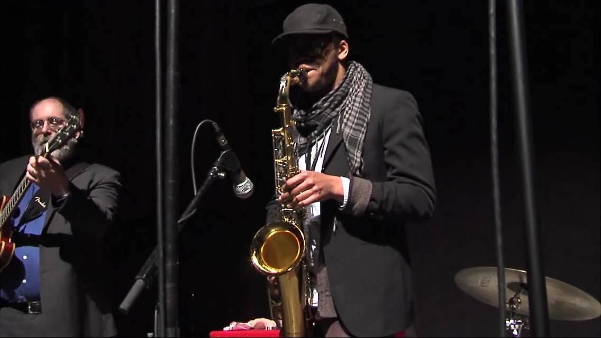

---
My name is Jim Carroll. I am an academic and musician living in Western Mass. As an academic, I specialize in the cultural history of some musicians associated with the Black Arts and Black Power Movements of the 1960s. As a musician, I play blues and jazz guitar, and I gig far too little.

No, I am not the [Jim Carroll](http://www.catholicboy.com) who wrote [*The Basketball Diaries*](https://www.amazon.com/Basketball-Diaries-Classic-Growing-Streets/dp/0140100180/ref=sr_1_2?ie=UTF8&qid=1496077294&sr=8-2&keywords=the+basketball+diaries); nor am I the [James Carroll](http://www.jamescarroll.net/JAMESCARROLL.NET/WELCOME.html) who writes for the [*Boston Globe*](https://www.bostonglobe.com). It is a handsome name, though, isn't it?

Check out my other blog at [pulamusic.com](http://www.pulamusic.com). You can also access my work portfolio [here](https://pulamusic.github.io/index.html), which includes a link to my doctoral dissertation, [*Composing the African Atlantic: Sun Ra, Fela Anikulapo-Kuti and the Poetics of African Diasporic Composition*](https://pulamusic.github.io/Carroll%20Dissertation%20Composing%20the%20African%20Atlantic.pdf).

---

